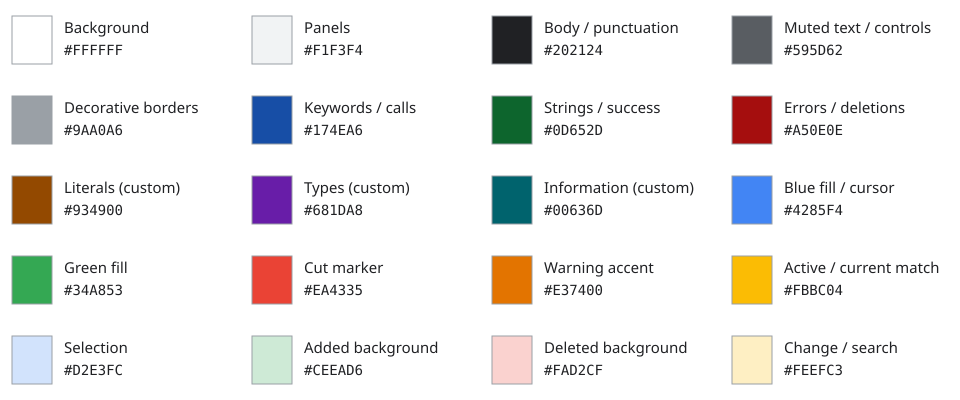
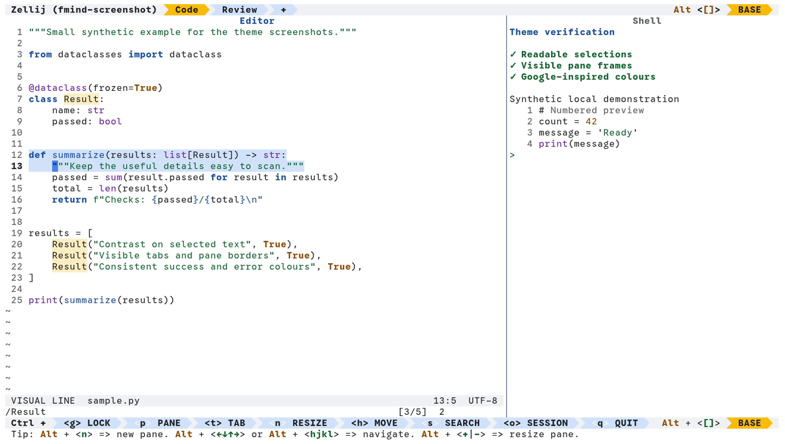
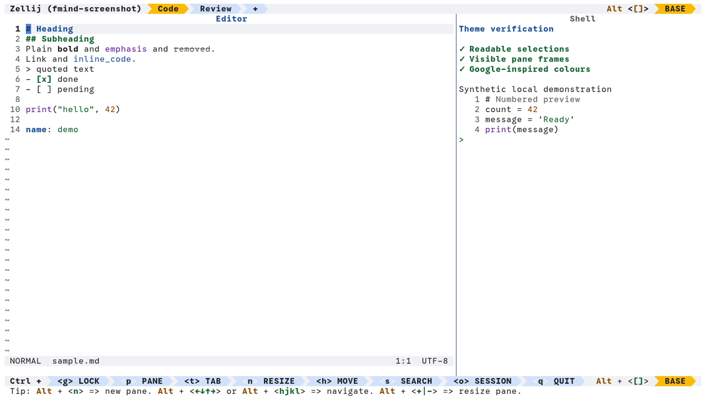

# fmind/theme

A light theme for everyday code and terminal work, with 483 integration directories. One folder per app, native theme files, no generator.

[Documentation](https://fmind.github.io/theme/) · [Downloads](https://github.com/fmind/theme/releases) · [Catalog](CATALOG.md)

All 472 entries in Dracula’s free catalog have a corresponding directory or shared integration. **This is inventory coverage, not verified application support.** Additional ports are experimental; some are incomplete drafts. Start with the 20 core integrations in [CATALOG.md](CATALOG.md), and read the [review findings](REVIEW.md) and [validation limits](VALIDATION.md) before installing other ports.

## Palette



The palette retains all 15 exact hex colors from [Google News](https://partnermarketinghub.withgoogle.com/brands/google-news/visual-identity/color-palette/), plus white, dark gray, dark orange, purple and teal. Dark gray and orange make secondary text and literals readable on pale surfaces; purple and teal distinguish types and information. The source’s RGB labels are inconsistent, so hex values are authoritative here. A dash means no role in that column.

| Color                | Hex       | Syntax and text                             | Interface and backgrounds                                         |
| -------------------- | --------- | ------------------------------------------- | ----------------------------------------------------------------- |
| White                | `#FFFFFF` | Label text on dark fills                    | Main background                                                   |
| Light gray           | `#F1F3F4` | —                                           | Panels, cursor line and neutral diffs                             |
| Gray                 | `#9AA0A6` | —                                           | Decorative borders and separators                                 |
| Dark gray (custom)   | `#595D62` | Comments, gutter numbers and secondary text | Essential control borders and scrollbar thumbs; ANSI bright black |
| Charcoal             | `#202124` | Body text, variables and punctuation        | Labels on bright fills; ANSI black/white                          |
| Dark blue            | `#174EA6` | Keywords, functions, keys and headings      | Navigation and links; ANSI blue                                   |
| Medium blue          | `#4285F4` | —                                           | Cursor and active label fills                                     |
| Light blue           | `#D2E3FC` | —                                           | Selections, completions and inactive ribbons                      |
| Dark red             | `#A50E0E` | Errors and deleted text                     | Failures and deletions; ANSI red                                  |
| Medium red           | `#EA4335` | —                                           | Cut markers and error underlines                                  |
| Light red            | `#FAD2CF` | —                                           | Deletion backgrounds                                              |
| Dark orange (custom) | `#934900` | Numbers, constants and warnings             | Changes and attention; ANSI yellow                                |
| Orange               | `#E37400` | —                                           | Warning accents                                                   |
| Yellow               | `#FBBC04` | —                                           | Active tabs, current search matches and changed words             |
| Light yellow         | `#FEEFC3` | —                                           | Change backgrounds and ordinary search matches                    |
| Dark green           | `#0D652D` | Strings and added text                      | Success, additions and executables; ANSI green                    |
| Medium green         | `#34A853` | —                                           | Mode labels, copy markers and success accents                     |
| Light green          | `#CEEAD6` | —                                           | Addition backgrounds                                              |
| Purple (custom)      | `#681DA8` | Types, builtins, decorators and emphasis    | Secondary accents; ANSI magenta                                   |
| Teal (custom)        | `#00636D` | Informational diagnostics                   | Information and icons; ANSI cyan                                  |

Dark shades carry text; pale shades carry selections, inactive ribbons and ordinary search matches; bright shades identify active states. Syntax and comments meet 4.5:1 on white, panels, selections and diffs. Bold distinguishes staged Git signs.

See the [shared state roles and ANSI policy](VALIDATION.md).

Recommended terminal font: **GoogleSansCode Nerd Font Mono**. Text stays upright; bold adds emphasis.

## Screenshots

| Code, shell, search and selection                                                        | Markdown                                               |
| ---------------------------------------------------------------------------------------- | ------------------------------------------------------ |
|  |  |

Captured with VHS using synthetic examples.

## Install

**Additional integrations are experimental.** The instructions below are proposed routes unless native acceptance is recorded in [VALIDATION.md](VALIDATION.md). A passing parser check does not prove an app recognizes a theme. Known incomplete drafts are marked explicitly.

Use a truecolor terminal with a light background. Paths are relative to `~/.config` or your app's configured directory. Merge fragments into existing settings.

| Tool | Theme file | Installation |
| --- | --- | --- |
| ABAP | [fmind.xml](abap/fmind.xml) | Import into Eclipse ABAP Development Tools via Preferences. |
| Ableton Live | [Fmind.ask](ableton-live/Fmind.ask) | Copy into Ableton Live skins directory and select Fmind in Preferences. |
| Abricotine | [fmind.css](abricotine/fmind.css) | Copy to ~/.config/Abricotine/themes/ and select in settings. |
| AdiIRC | [fmind.ini](adiirc/fmind.ini) | Place into AdiIRC Themes directory. |
| Adminer | [adminer.css](adminer/adminer.css) | Place beside adminer.php to style Adminer. |
| Adobe | [Fmind.ase](adobe/Fmind.ase) | Import the native ASE swatch library; supplies document colors, not application UI. See [instructions](adobe/README.md). |
| Advent of Code | [fmind.css](adventofcode/fmind.css) | Apply `adventofcode/fmind.css` via Stylus for `adventofcode.com`. |
| aerc | [fmind](aerc/fmind) | Copy `aerc/fmind` to `~/.config/aerc/stylesets/fmind` and set `styleset-name = fmind` in `aerc.conf`. |
| Alacritty | [fmind.toml](alacritty/fmind.toml) | Copy to `alacritty/themes/fmind.toml`; add it to `[general] import = ["~/.config/alacritty/themes/fmind.toml"]`. |
| Albert | [Fmind.qss](albert/Fmind.qss) | Copy to ~/.local/share/albert/widgetsboxmodel/themes/ and select in settings. |
| Alfred | [fmind.alfredappearance](alfred/fmind.alfredappearance) | Double-click or drag into Alfred Preferences → Appearance to import. |
| Aliucord | [fmind.json](aliucord/fmind.json) | Copy to `Aliucord/themes/` and enable in Settings → Themes. |
| AlphaI TUI | [fmind.json](alphai-tui/fmind.json) | Place `alphai-tui/fmind.json` in `~/.config/alphai/themes/`. |
| Amfora | [fmind.toml](amfora/fmind.toml) | Merge `amfora/fmind.toml` into `~/.config/amfora/config.toml`. |
| Anne Pro 2 | [fmind.json](anne-pro-2/fmind.json) | Import into ObinsKit or companion software. |
| Anytype | [custom.css](anytype/custom.css) | Experimental: choose Light, merge into the working directory’s `custom.css`, then Apply custom CSS. See [instructions](anytype/README.md). |
| Apache Superset | [fmind.json](superset/fmind.json) | Import into Superset theme configuration. |
| Apollo | [fmind.json](apollo/fmind.json) | Import into Apollo custom themes settings. |
| apt | [fmind.conf](apt/fmind.conf) | Copy to /etc/apt/apt.conf.d/99fmind. |
| Archive of Our Own | [fmind_ao3.css](archive-of-our-own/fmind_ao3.css) | Create a new site skin on AO3 and paste CSS. |
| Arduino IDE | [theme.txt](arduino-ide/theme.txt) | Replace or merge `theme.txt` under Arduino IDE `lib/theme/`. |
| Arduino Pro IDE | [fmind.json](arduino-pro-ide/themes/fmind.json) | Copy to Arduino IDE extensions directory and select in settings. |
| Aseprite | [theme](aseprite/theme.xml), [package](aseprite/package.json) | Incomplete draft: see [Aseprite status](aseprite/README.md) before use. |
| Atom | [package](atom/package.json), [styles](atom/styles/base.less) | Copy the `atom/` directory to `~/.atom/packages/fmind-syntax/`; reload Atom, then Settings → Themes → Syntax Theme → Fmind. Use a light UI theme. Targets Atom 1.13–1.60; Atom is archived upstream. |
| Atuin | [fmind.toml](atuin/fmind.toml) | Copy to `atuin/themes/fmind.toml`; set `[theme] name = "fmind"` in `atuin/config.toml`. |
| Audacity | [Fmind.cfg](audacity/Fmind.cfg) | Merge settings into ~/.audacity-data/audacity.cfg. |
| AutoAO3App | [fmind.user.css](auto-ao3-app/fmind.user.css) | Apply via Stylus extension. |
| Bandcamp | [fmind.css](bandcamp/fmind.css) | Apply `bandcamp/fmind.css` via Stylus for `bandcamp.com`. |
| Base16 | [fmind.yaml](base16/fmind.yaml) | Copy to Base16 schemes directory for use with Base16 builders. |
| Bashtop | [fmind.theme](bashtop/fmind.theme) | Copy to `~/.config/bashtop/themes/` and select in Options. |
| bat | [fmind.tmTheme](bat/fmind.tmTheme) | Copy to the `themes/` directory under `bat --config-dir`; run `bat cache --build`, then select `--theme=fmind`. |
| BBEdit | [Fmind.bbColorScheme](bbedit/Fmind.bbColorScheme) | Copy to `~/Library/Application Support/BBEdit/Color Schemes/` and select Fmind. |
| Beamer | [beamercolorthemefmind.sty](beamer/beamercolorthemefmind.sty) | Copy into document directory and use \usecolortheme{fmind}. |
| Bear | [fmind.bear](bear/fmind.bear) | Import in Bear Preferences → Themes. |
| Beeper | [fmind.css](beeper/fmind.css) | Apply custom CSS in Beeper settings. |
| bemenu | [fmind.sh](bemenu/fmind.sh) | Source in shell configuration or prefix bemenu command. |
| BetterCanvas | [fmind.txt](bettercanvas/fmind.txt) | Import preset JSON into BetterCanvas options. |
| BetterDiscord | [fmind.theme.css](betterdiscord/fmind.theme.css) | Copy to BetterDiscord `themes/` folder and enable in Settings → Themes. |
| Beyond Compare 4 | [BCColors-Fmind.xml](beyond-compare-4/BCColors-Fmind.xml) | Import settings in Tools → Import Settings. |
| Blender | [fmind.xml](blender/fmind.xml) | Install theme in Blender Preferences → Themes. |
| Blink Shell | [fmind.js](blink-shell/fmind.js) | In Blink Shell, open Settings → Appearance and load fmind.js. |
| Blockbench | [Fmind.bbtheme](blockbench/Fmind.bbtheme) | Open File → Preferences → Theme and load theme. |
| bobthefish | [fmind.fish](bobthefish/fmind.fish) | Source in config.fish to define Fmind color scheme. |
| BookWyrm | [fmind.css](bookwyrm/fmind.css) | Apply `bookwyrm/fmind.css` with Stylus to your BookWyrm instance. |
| bottom | [fmind.toml](bottom/fmind.toml) | Merge `[styles]` and its sections into `bottom/bottom.toml`. |
| Brackets | [package](brackets/package.json), [theme.css](brackets/theme.css) | Help → Show Extensions Folder; copy `brackets/` into its `user/fmind-theme/` directory. Restart, then View → Themes → Fmind. Includes CodeMirror syntax, selections, search, matching brackets and completion styles. |
| bspwm | [fmind.sh](bspwm/fmind.sh) | Copy to `bspwm/fmind.sh`; source with `. "$HOME/.config/bspwm/fmind.sh"` near the end of `bspwmrc`. Colors window borders and preselection feedback. |
| BTCPay Server | [fmind.css](btcpay-server/fmind.css) | Add to BTCPay Server custom theme settings. |
| btop | [fmind.theme](btop/fmind.theme) | Copy to `btop/themes/fmind.theme`; select `fmind` in Options or set `color_theme = "fmind"` in `btop/btop.conf`. |
| CadZinho | [fmind.json](cadzinho/fmind.json) | Copy to CadZinho theme directory. |
| Calibre | [fmind.calibre-palette](calibre/fmind.calibre-palette) | Import in Preferences → Look & Feel → Color palette. |
| Campfire | [fmind.css](campfire/fmind.css) | Apply via Stylus browser extension. |
| Caprine Messenger | [custom.css](caprine-messenger/custom.css) | In Caprine, open Preferences → Advanced → Custom Styles and paste stylesheet. |
| Castero | [fmind.conf](castero/fmind.conf) | Merge `castero/fmind.conf` into `~/.config/castero/castero.conf`. |
| Cava | [config](cava/config) | Include in ~/.config/cava/config. |
| ChatGPT | [fmind.user.css](chatgpt/fmind.user.css) | Apply via Stylus browser extension. |
| Chatterino | [fmind.json](chatterino/fmind.json) | Copy `chatterino/fmind.json` to `~/.local/share/chatterino/Themes/`. |
| Chrome | [manifest.json](chrome/manifest.json) | Open `chrome://extensions`, enable Developer mode, choose Load unpacked, and select `chrome/`. Styles browser chrome and the new-tab page, not websites. |
| Cider | [theme.json](cider/theme.json) | Copy folder into Cider themes directory and select in settings. |
| Claude Code | [config.json](claude-code/config.json) | Run `/theme` and choose **Light (ANSI colors only)** with a Fmind terminal palette; see [instructions](claude-code/README.md). |
| Cli-Visualizer | [fmind.vis](cli-visualizer/fmind.vis) | Copy to ~/.config/vis/colors/fmind and set colors.scheme=fmind. |
| Clone Hero | [Fmind.ini](clone-hero/Fmind.ini) | Copy to Clone Hero Custom/Colors/. |
| Cmder | [fmind.xml](cmder/fmind.xml) | Import into Cmder/ConEmu Settings → Features → Colors. |
| Coda | [Fmind.seestyle](coda/Fmind.seestyle) | Double-click or copy to `~/Library/Application Support/Coda 2/Styles/`. |
| Code::Blocks | [fmind.conf](codeblocks/fmind.conf) | Close Code::Blocks; open its `cb_share_config` utility with this file as source and your `default.conf` as destination. Select only `editor → colour_sets → fmind`, Transfer and Save. Reopen, then Settings → Editor → Syntax highlighting → Colour theme → Fmind. Covers 62 lexers from 25.03; import details below. |
| Codeforces | [fmind.css](codeforces/fmind.css) | Apply `codeforces/fmind.css` via Stylus for `codeforces.com`. |
| CodePen | [codepen.user.css](codepen/codepen.user.css) | Apply via Stylus browser extension. |
| CodeRunner | [Fmind.tmTheme](coderunner/Fmind.tmTheme) | Import in Preferences → Appearance. |
| colorls | [fmind.yaml](colorls/fmind.yaml) | Copy to `~/.config/colorls/fmind.yaml` or use `--theme`. |
| ColorSlurp | [fmind.json](color-slurp/fmind.json) | Import into ColorSlurp palettes. |
| ConEmu | [fmind.xml](conemu/fmind.xml) | Save a custom Fmind scheme in Settings → Features → Colors, then close ConEmu. In `ConEmu.xml`, replace that saved `PaletteN` key’s values with this file’s values, retaining its `PaletteN` key name. Reopen and select Fmind. Slot 15 is reserved for the white canvas; ANSI bright-white text needs an app override. |
| CopyQ | [fmind.ini](copyq/fmind.ini) | Open Theme in Preferences → Appearance. |
| COSMIC Terminal | [fmind.ron](cosmic-terminal/fmind.ron) | Choose Light application appearance, then View → Color schemes → Import and select the RON file. Select Fmind for your light terminal profile. Includes explicit white background and normal, bright and dim palettes. |
| CotEditor | [Fmind.cottheme](coteditor/Fmind.cottheme) | Copy to CotEditor Themes and select in Settings. |
| Couscous | [fmind.css](couscous/fmind.css) | Include in couscous.yml template styles. |
| Cryptowatch | [fmind.txt](cryptowatch/fmind.txt) | Import color string into Cryptowatch theme settings. |
| Cursor | [package](cursor/package.json), [theme](cursor/fmind-color-theme.json) | Copy the `cursor/` folder into `~/.cursor/extensions/fmind-cursor/` and select Fmind in Color Theme. |
| Cutter | [fmind.json](cutter/fmind.json) | Import into Cutter Edit → Preferences → Color Themes. |
| DankMaterialShell | [fmind.css](dankmaterialshell/fmind.css) | Copy to DankMaterialShell custom themes directory. |
| Dash | [fmind.css](dash/fmind.css) | Apply custom CSS in Dash preferences. |
| DeepSeek | [fmind.css](deepseek/fmind.css) | Apply `deepseek/fmind.css` using Stylus for `chat.deepseek.com`. |
| Delphi | [fmind.reg](delphi/fmind.reg) | Import into Windows registry for BDS/Delphi IDE. |
| delta | [fmind.gitconfig](delta/fmind.gitconfig) | Include from Git configuration; install the bat theme first. |
| Dev-C++ | [Fmind.syntax](dev-cpp/Fmind.syntax) | Copy to your Dev-C++ configuration directory (normally `%APPDATA%\Dev-Cpp`, or the portable configuration directory). Restart, then Tools → Editor Options → Colors → Fmind. Uses native Windows BGR colors for C/C++, gutter, selection, breakpoints and error lines. |
| dircolors | [.dircolors](dircolors/.dircolors) | Add `eval "$(dircolors -b path/to/.dircolors)"` to shell rc. |
| Directory Opus | [fmind.dps](directory-opus/fmind.dps) | Import into Directory Opus Preferences → Colors and Fonts. |
| Dirtywave M8 | [fmind.m8t](m8/fmind.m8t) | Copy to /Themes on M8 SD card and load in Project Settings. |
| Discord Bot Maker | [main.css](discordbotmaker/main.css) | Copy into themes directory and select in Preferences. |
| Discourse | [component](discourse/about.json), [styles](discourse/common/common.scss) | Install as a theme component from git in Discourse Admin. |
| Ditto | [Fmind.xml](ditto/Fmind.xml) | Copy to Themes/ directory in Ditto. |
| Django Admin | [fmind.css](django-admin/fmind.css) | Include in custom admin base template. |
| dmenu | [fmind.h](dmenu/fmind.h) | Copy beside dmenu’s `config.h`; replace its complete `colors` definition with `#include "fmind.h"`, then rebuild dmenu with your normal build procedure. Choose Google Sans through its `fonts` setting. Includes normal, selected and output schemes. |
| Docker | [fmind.json](docker/fmind.json) | Merge color overrides into Docker Desktop settings. |
| DOOM Emacs | [doom-fmind-theme.el](doom-emacs/doom-fmind-theme.el) | Copy to `~/.doom.d/themes/` and set `(setq doom-theme 'doom-fmind)`. |
| Dracula CSS | [fmind.css](dracula-css/fmind.css) | Import `dracula-css/fmind.css` into your web project or stylesheet. |
| Drafts | [fmind.yml](drafts/fmind.yml) | Import into Drafts theme directory. |
| DuckDuckGo | [fmind.user.css](duckduckgo/fmind.user.css) | Apply via Stylus extension or URL parameters. |
| Dunst | [fmind.conf](dunst/fmind.conf) | Merge into `dunst/dunstrc`, then reload Dunst. Includes all three urgency levels. |
| Duolingo | [duolingo.user.css](duolingo/duolingo.user.css) | Apply via Stylus browser extension. |
| Dwarf Fortress | [colors.txt](dwarf-fortress/colors.txt) | Replace data/init/colors.txt in Dwarf Fortress. |
| Dyalog APL | [fmind.json](dyalog/fmind.json) | Import into Dyalog APL session color settings. |
| Eclipse | [preferences](eclipse/fmind.epf), [theme XML](eclipse/fmind.xml) | Select the Light workbench theme, then File → Import → General → Preferences and choose `fmind.epf`; restart. Covers core editors, JDT, CDT, Ant, debug console and PyDev. If using Eclipse Color Theme or DevStyle, import `fmind.xml` in that plugin’s Color Theme panel and select Fmind. |
| EditPlus | [fmind.ini](editplus/fmind.ini) | Import via Tools → Preferences → Colors. |
| eM Client | [Fmind.emtheme](em-client/Fmind.emtheme) | Import in Settings → Appearance → Themes. |
| Emacs | [fmind-theme.el](emacs/fmind-theme.el) | Copy to `~/.emacs.d/themes/`, add that directory to `custom-theme-load-path`, then use `M-x load-theme` → `fmind`. |
| EverythingToolbar | [Fmind.xaml](everythingtoolbar/Fmind.xaml) | Copy to %APPDATA%\EverythingToolbar\Themes\. |
| Evidence | [fmind.yaml](evidence/fmind.yaml) | Merge into evidence.config.yaml. |
| exa | [exa_colors.sh](exa/exa_colors.sh) | Source in ~/.bashrc or ~/.zshrc. |
| eza | [theme.yml](eza/theme.yml) | Copy to ~/.config/eza/theme.yml. |
| Facebook | [fmind.css](facebook/fmind.css) | Apply `facebook/fmind.css` via Stylus for `facebook.com`. |
| Facebook Messenger | [fmind.user.css](facebook-messenger/fmind.user.css) | Apply via Stylus extension to messenger.com. |
| Fastfetch | [fmind.json](fastfetch/fmind.json) | Merge `display.color` into `fastfetch/config.jsonc`. |
| Fedilab | [fmind.json](fedilab/fmind.json) | Import into Fedilab Theme settings. |
| Fig | [theme.json](fig/theme.json) | Copy to ~/.fig/themes/fmind.json and select in settings. |
| Figma | [tokens](figma/tokens.json) | Import design tokens into Figma via Tokens Studio. |
| Files | [fmind.json](files/fmind.json) | Copy to Files App Custom Themes folder. |
| Firefox | [manifest.json](firefox/manifest.json) | For local testing, use `about:debugging` → This Firefox → Load Temporary Add-on and select the manifest. Lasts until restart; permanent installation requires Mozilla signing. Styles browser UI, not websites. |
| Fish | [fmind.fish](fish/fmind.fish) | Copy to `fish/conf.d/fmind.fish`. |
| FL Studio 21 | [Fmind.fltheme](fl-studio-21/Fmind.fltheme) | Copy to `Settings\Themes\` and select in Options → Theme Settings. |
| Flarum | [fmind.css](flarum/fmind.css) | Paste into Appearance → Custom CSS in Flarum Admin. |
| FlorisBoard | [fmind.json](florisboard/fmind.json) | Import in FlorisBoard Settings → Theme. |
| Flowlab | [fmind.css](flowlab/fmind.css) | Apply via Stylus extension for flowlab.io. |
| Fluent Terminal | [fmind.flutecolors](fluent-terminal/fmind.flutecolors) | Settings → Themes → Import; choose the file and select Fmind. Set the application appearance to Light. |
| Fluxbox | [fmind](fluxbox/fmind) | Copy `fluxbox/fmind` to `~/.fluxbox/styles/fmind`. |
| fman | [Theme.css](fman/Theme.css) | Copy into fman plugins/themes folder. |
| FocusWriter | [fmind.fwt](focuswriter/fmind.fwt) | Import `focuswriter/fmind.fwt` in FocusWriter Settings → Themes. |
| FontForge | [fmind.txt](fontforge/fmind.txt) | Append to ~/.Xresources or FontForge configuration. |
| foot | [fmind.ini](foot/fmind.ini) | For foot 1.28+, copy to `foot/themes/fmind.ini`; add `include=~/.config/foot/themes/fmind.ini` before any section in `foot/foot.ini`. The fragment selects the light palette. |
| Forgejo | [fmind.css](forgejo/fmind.css) | Place `forgejo/fmind.css` in `custom/public/assets/css/theme-fmind.css`. |
| ForkLift | [fmind.flcolors](forklift/fmind.flcolors) | Import into ForkLift Settings → Themes. |
| FreeCAD | [Fmind.qss](freecad/Fmind.qss) | Copy to Stylesheets folder and select in Preferences → Style sheet. |
| FreeTube | [fmind.css](freetube/fmind.css) | Import `freetube/fmind.css` into FreeTube Settings → Theme Settings. |
| FreshRSS | [fmind.css](freshrss/fmind.css) | Place `freshrss/fmind.css` in `p/themes/fmind/fmind.css`. |
| Funkwhale | [fmind.css](funkwhale/fmind.css) | Apply `funkwhale/fmind.css` in your Funkwhale instance settings. |
| Fuzzel | [fmind.ini](fuzzel/fmind.ini) | Copy to `fuzzel/fmind.ini`; add `include=~/.config/fuzzel/fmind.ini` before any section in `fuzzel/fuzzel.ini`, or merge the `[colors]` section. Set `font=Google Sans` in the default section if desired. Covers all twelve color roles with opaque RGBA values. |
| fzf | [fmind.conf](fzf/fmind.conf) | Set `FZF_DEFAULT_OPTS_FILE` to this file’s absolute path. |
| Gajim | [fmind.css](gajim/fmind.css) | Copy into Gajim styles directory or paste into settings. |
| GameMaker Studio | [fmind.json](gamemaker-studio/fmind.json) | Copy to GameMaker Studio 2 `Themes/` directory and select Fmind in Preferences. |
| Gamepad Viewer | [fmind.css](gamepad-viewer/fmind.css) | Enter CSS URL in gamepadviewer.com URL generator or apply in OBS browser source. |
| Geany | [fmind.conf](geany/fmind.conf) | Copy to `geany/colorschemes/fmind.conf`; choose View → Change Color Scheme → Fmind. Covers shared language styles and editor decorations. |
| Gedit | [fmind.xml](gedit/fmind.xml) | Copy to `~/.local/share/gtksourceview-4/styles/` and select Fmind in Preferences → Font & Colors. GtkSourceView 5 apps use `gtksourceview-5/styles/`. |
| Gemini | [fmind.css](gemini/fmind.css) | Apply in Gemini client styling options. |
| ggplot2 | [fmind.R](ggplot2/fmind.R) | Source `ggplot2/fmind.R` in your R session and add `+ theme_fmind()`. |
| gh-dash | [fmind.yml](gh-dash/fmind.yml) | Merge `theme` into `gh-dash/config.yml`. |
| Ghostty | [fmind](ghostty/fmind) | Copy to `ghostty/themes/fmind`; set `theme = fmind`. |
| ghostwriter | [Fmind.json](ghostwriter/Fmind.json) | Copy into ~/.local/share/ghostwriter/themes/ and select in Settings. |
| GIMP | [Fmind.gpl](gimp/Fmind.gpl) | Copy to GIMP palettes directory. |
| Git | [fmind.gitconfig](git/fmind.gitconfig) | Include from `~/.gitconfig` for colored CLI diff and status output. |
| GitHub | [fmind.user.css](github/fmind.user.css) | Apply via Stylus extension to github.com. |
| GitHub Pages | [config](gh-pages/_config.yml), [styles](gh-pages/assets/css/style.css) | Add to GitHub Pages Jekyll repository root. |
| Gitk | [fmind.gitk](gitk/fmind.gitk) | Merge into `~/.config/git/gitk` or `~/.gitk`. |
| GitKraken | [fmind-theme.jsonc](gitkraken/fmind-theme.jsonc) | Copy to ~/.gitkraken/themes/. |
| GitLab | [fmind.user.css](gitlab/fmind.user.css) | Apply via Stylus extension to gitlab.com. |
| Gitroll | [fmind.css](gitroll/fmind.css) | Apply via Stylus for gitroll.io. |
| GMK | [fmind.json](gmk/fmind.json) | Import into keycap design tools or previewers supporting GMK palettes. |
| GNOME Terminal | [fmind.dconf](gnome-terminal/fmind.dconf) | Import into a chosen profile with the scoped command below. The fragment only changes colors. |
| GNU grep | [fmind.sh](grep/fmind.sh) | Source `grep/fmind.sh` or export `GREP_COLORS` in shell configuration. |
| GoAccess | [fmind.conf](go-access/fmind.conf) | Include `go-access/fmind.conf` in `~/.goaccessrc`. |
| Godot | [fmind.tet](godot/fmind.tet) | Copy to `text_editor_themes/` and select Fmind in Editor Settings → Text Editor. |
| Google Calendar | [fmind.user.css](google-calendar/fmind.user.css) | Apply via Stylus extension to calendar.google.com. |
| Google Search | [google-search.user.css](google-search/google-search.user.css) | Apply via Stylus browser extension. |
| GRUB | [theme.txt](grub/theme.txt) | Copy to `/boot/grub/themes/fmind/` and set `GRUB_THEME`. |
| GTK | [package and installation](gtk/README.md) | Copy the complete directory to `~/.themes/Fmind/` and select Fmind in your GTK theme chooser. Includes KDE colors, Plasma styling, Aurorae decorations, Kvantum widgets, cursors and a global theme/startup splash, GNOME Shell and Cinnamon desktop colors, GTK 2, GTK 3.20+ and GTK 4 widgets plus Metacity/Xfwm decorations, with additional installation paths in the package guide. Other desktop-shell companions remain pending. |
| GtkSourceView | [fmind.xml](gtksourceview/fmind.xml) | Copy `gtksourceview/fmind.xml` to `~/.local/share/gtksourceview-4/styles/` (or `5/styles/`). |
| Hacker News | [fmind.user.css](hacker-news/fmind.user.css) | Apply via Stylus extension to news.ycombinator.com. |
| Harpy for Twitter | [fmind.json](harpy-for-twitter/fmind.json) | Select custom theme and import into Harpy. |
| Helix | [fmind.toml](helix/fmind.toml) | Copy to `helix/themes/fmind.toml`; set `theme = "fmind"` in `helix/config.toml`. |
| Hermes Agent | [fmind.yaml](hermes-agent/fmind.yaml) | Place in Hermes Agent config folder. |
| Heroic Games Launcher | [fmind.json](heroic-games-launcher/fmind.json) | Import into Heroic Games Launcher themes settings. |
| highlight.js | [fmind.css](highlightjs/fmind.css) | Include in web projects using highlight.js syntax highlighting. |
| Home Assistant | [fmind.yaml](home-assistant/fmind.yaml) | Add `home-assistant/fmind.yaml` into your `themes/` directory in Home Assistant. |
| Homepage | [custom.css](homepage-app/custom.css) | Copy to Homepage config/custom.css. |
| Homer | [fmind.css](homer/fmind.css) | Include in Homer assets directory and configure in `config.yml`. |
| Hyper | [fmind.json](hyper/fmind.json) | Copy beside `.hyper.js`; merge `...require("./fmind.json")` into its `config` object. Use Hyper’s Edit → Preferences to locate the config. |
| HyperX NGENUITY | [fmind.json](ngenuity/fmind.json) | Import into NGENUITY profiles. |
| Hyprland | [fmind.lua](hyprland/fmind.lua), [Hyprlock](hyprland/hyprlock.conf) | For Hyprland 0.55+, copy the Lua file beside `hypr/hyprland.lua`; load `require("fmind")` after appearance settings. Includes borders, group titles and a white desktop background. For Hyprlock, merge the supplied background, input-field and clock widgets into `hypr/hyprlock.conf`, replacing existing equivalents. Authentication settings remain yours. |
| i3 | [fmind.conf](i3/fmind.conf) | Copy to `i3/fmind.conf`; add `include ~/.config/i3/fmind.conf` to the i3 config, then reload. Styles window borders and titles; your bar configuration stays separate. |
| i3lock-color | [lock.sh](i3lock-color/lock.sh) | Run lock.sh to lock screen. |
| IBM ACS | [fmind.col](acs/fmind.col) | Import into IBM ACS 5250 Session colors. |
| IDA Pro | [fmind.clr](ida/fmind.clr) | Import via Options → Colors → Import. |
| IDLE | [fmind.cfg](idle/fmind.cfg) | With IDLE closed, merge the `[Fmind]` section into `~/.idlerc/config-highlight.cfg`. Reopen, then Options → Configure IDLE → Highlights → Custom Theme → Fmind. Restart to update the cursor. |
| ImageGlass | [config.xml](imageglass/config.xml) | Import within your ImageGlass Themes directory. |
| Infinity for Reddit | [fmind.json](infinity-for-reddit/fmind.json) | Import into Infinity Theme settings. |
| Inkscape | [fmind.gpl](inkscape/fmind.gpl) | Copy to ~/.config/inkscape/palettes/ and select in palette bar. |
| Insomnia | [package](insomnia/package.json), [index.js](insomnia/index.js) | Install plugin into Insomnia plugins directory and select Fmind theme. |
| iSH | [Fmind.json](ish/Fmind.json) | Import in iSH preferences under Color Schemes. |
| iTerm2 | [fmind.itermcolors](iterm2/fmind.itermcolors) | Import through Settings → Profiles → Colors → Color Presets, then select `fmind`. |
| ITFY | [fmind.user.css](itfy/fmind.user.css) | Apply via Stylus extension. |
| JabRef | [fmind.css](jabref/fmind.css) | Select custom CSS in JabRef Preferences → Appearance. |
| Javadoc | [stylesheet.css](javadoc/stylesheet.css) | Pass with --stylesheetfile when generating Javadoc. |
| JDownloader 2 | [fmind.json](jdownloader2/fmind.json) | Import in Advanced Settings → GraphicalUserInterfaceSettings: Look And Feel. |
| Jellyfin | [fmind.css](jellyfin/fmind.css) | Paste `jellyfin/fmind.css` into Jellyfin Dashboard → General → Custom CSS. |
| JetBrains | [fmind.icls](jetbrains/fmind.icls) | Settings → Editor → Color Scheme → gear menu → Import Scheme. Select `fmind` and a light IDE appearance. Covers language defaults, editor and console; not a UI plugin. |
| jGRASP | [fmind.colors](jgrasp/fmind.colors) | Settings → Color Schemes → Import in jGRASP. |
| Joplin | [userchrome.css](joplin/userchrome.css) | Copy to ~/.config/joplin-desktop/ configuration directory. |
| Jupyter Notebook | [installation](jupyter-notebook/README.md), [classic CSS](jupyter-notebook/custom.css) | Notebook 7 uses the JupyterLab Fmind extension. For Notebook 6 or NbClassic, copy the CSS to `custom/custom.css` under `jupyter --config-dir`, preserving existing customizations. |
| JupyterLab | [package and installation](jupyterlab/README.md), [theme CSS](jupyterlab/style/index.css) | Build and install the wheel into the Jupyter environment, restart, then Settings → Theme → Fmind. Native JupyterLab 4.6+ theme with notebook, editor, output and UI coverage. |
| k9s | [fmind.yaml](k9s/fmind.yaml) | Copy to the skins directory shown by `k9s info`; select `k9s.ui.skin: fmind` in its config. |
| Kagi | [fmind.css](kagi/fmind.css) | Paste `kagi/fmind.css` into Kagi Settings → Appearance → Custom CSS. |
| Kakoune | [fmind.kak](kakoune/colors/fmind.kak) | Copy to ~/.config/kak/colors/ and add colorscheme fmind to kakrc. |
| Kali Browser | [fmind.css](kali-browser/fmind.css) | Apply in browser styling options. |
| KanbanFlow | [fmind.css](kanbanflow/fmind.css) | Apply via Stylus for kanbanflow.com. |
| Kate | [fmind.theme](kate/fmind.theme) | Settings → Configure Kate → Color Themes → Import. Select Fmind. Also usable by KSyntaxHighlighting applications. |
| KDiff3 | [kdiff3rc](kdiff3/kdiff3rc) | Merge into ~/.config/kdiff3rc. |
| Keybr | [fmind.css](keybr/fmind.css) | Apply `keybr/fmind.css` via Stylus for `keybr.com`. |
| Keypirinha | [fmind.ini](keypirinha/fmind.ini) | Append theme section to Keypirinha.ini. |
| KiCad | [fmind.json](kicad/fmind.json) | Copy to KiCad `colors/` folder and select in Schematic Editor Preferences. |
| Kitty | [fmind.conf](kitty/fmind.conf) | Copy to `kitty/themes/fmind.conf`; add `include themes/fmind.conf` to `kitty/kitty.conf`. |
| Konsole | [fmind.colorscheme](konsole/fmind.colorscheme) | Copy to `~/.local/share/konsole/fmind.colorscheme`; select `fmind` under Edit Profile → Appearance. Selection and cursor use Konsole’s profile behavior. |
| Kristall | [fmind.ini](kristall/fmind.ini) | Import `kristall/fmind.ini` into Kristall settings. |
| Krita | [Fmind.colors](krita/Fmind.colors) | Copy to color-schemes and select in Settings → Color Themes. |
| Kurozora | [fmind.json](kurozora/fmind.json) | Import into Kurozora appearance settings. |
| LabPlot | [fmind.xml](labplot/fmind.xml) | Import into LabPlot color schemes. |
| LaTeX | [fmindtheme.sty](latex/fmindtheme.sty) | Include with \usepackage{fmindtheme} in LaTeX documents. |
| Lazydocker | [fmind.yml](lazydocker/fmind.yml) | Merge `gui.theme` into Lazydocker’s `config.yml`. |
| LazyGit | [fmind.yml](lazygit/fmind.yml) | Merge `gui.theme` into the config directory shown by `lazygit --print-config-dir`. |
| LCD Smartie | [fmind.ini](lcd-smartie/fmind.ini) | Place into LCD Smartie skins/ directory. |
| LDoc | [fmind.css](ldoc/fmind.css) | Set `style = "path/to/fmind.css"` in your `config.ld`. |
| LeetCode | [fmind.css](leetcode/fmind.css) | Apply `leetcode/fmind.css` via Stylus for `leetcode.com`. |
| LeftWM | [theme.ron](leftwm/theme.ron) | Copy `leftwm/theme.ron` to your LeftWM theme directory. |
| Libreddit | [fmind.css](libreddit/fmind.css) | Configure `libreddit/fmind.css` as custom CSS in Libreddit settings. |
| LibreNMS | [fmind.user.css](librenms/fmind.user.css) | Apply via Stylus for LibreNMS. |
| LibreOffice | [fmind.soc](libreoffice/fmind.soc) | Copy to LibreOffice user `config/` directory to enable Fmind color palette. |
| Lichess | [fmind.user.css](lichess/fmind.user.css) | Apply via Stylus extension for lichess.org. |
| Light Table | [fmind.css](light-table/fmind.css) | Add `[:app :lt.objs.style/set-skin "fmind"]` to `user.behaviors`. |
| LightPaper | [Fmind.txt](lightpaper/Fmind.txt) | Copy to themes directory and select in Preferences. |
| LimeChat | [Fmind.css](limechat/Fmind.css) | Copy to ~/Library/Application Support/LimeChat/Themes/. |
| Linear | [fmind.json](linear/fmind.json) | Configure custom theme in Settings → Preferences → Theme. |
| Linux TTY | [fmind-tty.sh](tty/fmind-tty.sh) | Run in virtual console or source from ~/.bashrc. |
| LiteIDE | [fmind.xml](liteide/fmind.xml) | Copy to share/liteide/liteeditor/color/. |
| lnav | [fmind.json](lnav/fmind.json) | Copy `lnav/fmind.json` to `~/.lnav/formats/installed/fmind.json` and select with `:config /ui/theme fmind-theme`. |
| Logseq | [custom.css](logseq/custom.css) | Append to graph's `logseq/custom.css`. |
| lsd | [fmind.yaml](lsd/fmind.yaml) | Copy to `lsd/colors.yaml`; set `color.theme: custom` in `lsd/config.yaml`. |
| LTSpice | [fmind-ltspice.ini](ltspice/fmind-ltspice.ini) | Merge settings into LTspice configuration. |
| lualine | [fmind.lua](lualine/fmind.lua) | Copy to `nvim/lua/lualine/themes/fmind.lua`; select `fmind` or `auto`. |
| LXTerminal | [fmind.conf](lxterminal/fmind.conf) | Close LXTerminal; merge the `[general]` entries into `lxterminal/lxterminal.conf`, preserving your shortcuts and other settings. Reopen. Uses the Custom palette and disables brightening bold text. |
| MacDown | [Fmind.style](macdown/Fmind.style) | Copy to `~/Library/Application Support/MacDown/Themes/` and select in Preferences. |
| MacDown CSS | [fmind.css](macdown-css/fmind.css) | Copy `macdown-css/fmind.css` to `~/Library/Application Support/MacDown/Styles/`. |
| macOS Color Picker | [palette.json](macos-color-picker/palette.json) | Import palette colors into macOS color palette. |
| Mailspring | [package](mailspring/package.json), [variables](mailspring/ui-variables.less) | Install in Mailspring via Edit → Install Theme. |
| Makehuman | [fmind.qss](makehuman/fmind.qss) | Copy to makehuman/data/themes/. |
| Mako | [config](mako/config) | Copy to ~/.config/mako/config. |
| man pages | [fmind.sh](man-pages/fmind.sh) | Source `man-pages/fmind.sh` in shell profile for `less` termcap colors. |
| Mantine | [fmind.json](mantine/fmind.json) | Import into MantineProvider theme object. |
| Markdown CSS | [fmind.css](markdown-css/fmind.css) | Link `markdown-css/fmind.css` in your Markdown HTML previewer or renderer. |
| Marp | [fmind.css](marp/fmind.css) | Pass `--theme marp/fmind.css` or define as custom theme in Marp CLI / Marp for VS Code. |
| Marta | [fmind.kana](marta/fmind.kana) | Copy to Marta Themes directory. |
| MATLAB | [current JSON](matlab/fmind.json), [legacy preferences](matlab/fmind.prf), [installation](matlab/README.md) | R2025a+ uses MathWorks Color Theme Extensions and `import_scheme`. Older releases use MATLAB Schemer. Covers MATLAB and 15 additional language sections in the current format. |
| Matplotlib | [fmind.mplstyle](matplotlib/fmind.mplstyle) | Use `plt.style.use("/path/to/fmind.mplstyle")`, or copy to `stylelib/` under `matplotlib.get_configdir()` and use `plt.style.use("fmind")`. |
| Mattermost | [fmind.json](mattermost/fmind.json) | Import custom theme JSON in Settings → Display → Theme. |
| MetaEditor | [metaeditor.ini](metaeditor/metaeditor.ini) | Add Colors section to MetaEditor config. |
| MetaTrader 5 | [Fmind.tpl](metatrader5/Fmind.tpl) | Copy to MT5 `templates/` folder and apply to chart. |
| Micro | [fmind.micro](micro/fmind.micro) | Copy to `micro/colorschemes/fmind.micro`; run `set colorscheme fmind` in the Ctrl-E command prompt. Requires truecolor. |
| Microsoft Edge | [manifest.json](microsoft-edge/manifest.json) | Load unpacked extension in `edge://extensions`. |
| Midnight Commander | [fmind.ini](midnight-commander/fmind.ini) | Copy to `~/.local/share/mc/skins/fmind.ini` and set `skin=fmind` in `mc.ini`. |
| MindNode | [fmind.mindnodetheme](mindnode/fmind.mindnodetheme/contents.xml) | Double-click or copy to MindNode Themes to import. |
| Minecraft | [pack.mcmeta](minecraft/pack.mcmeta) | Incomplete draft: see [Minecraft status](minecraft/README.md) before use. |
| Miniflux | [fmind.css](miniflux/fmind.css) | Paste `miniflux/fmind.css` into Miniflux Settings → Custom CSS. |
| Mintty | [fmind.minttyrc](mintty/fmind.minttyrc) | Merge into `~/.minttyrc` or load the file with `mintty -C /path/to/fmind.minttyrc`. |
| Misskey | [fmind.json](misskey/fmind.json) | Install `misskey/fmind.json` in Misskey Settings → Themes. |
| MiXplorer | [Fmind.mit](mixplorer/Fmind.mit) | Import skin in Settings → Skin → Add skin. |
| MkDocs | [fmind.css](mkdocs/fmind.css) | Add to extra_css in mkdocs.yml. |
| MobaXterm | [fmind.ini](mobaxterm/fmind.ini) | Close MobaXterm; merge `[Colors]` into `MobaXterm.ini` (its location is shown in Settings → Configuration → General). Reopen. Per-session color settings can override global colors. |
| Monkeytype | [fmind.json](monkeytype/fmind.json) | Import custom theme values in Monkeytype Settings → Custom Theme. |
| MonoDevelop | [Fmind.json](monodevelop/Fmind.json) | Copy to MonoDevelop `styles/` directory and select Fmind under Text Editor. |
| Mousepad | [fmind.xml](mousepad/fmind.xml) | Copy to `~/.local/share/gtksourceview-4/styles/` and select Fmind in Preferences. |
| mRemoteNG | [fmind.xml](mremoteng/fmind.xml) | Place into mRemoteNG Themes directory. |
| MusicBee | [Fmind.xml](musicbee/Fmind.xml) | Copy to MusicBee Skins directory. |
| musikcube | [fmind.json](musikcube/fmind.json) | Place `musikcube/fmind.json` in `~/.config/musikcube/themes/`. |
| Mutt | [fmind.muttrc](mutt/fmind.muttrc) | Source in `~/.muttrc` or `~/.neomuttrc`. |
| MySQL Workbench | [code_editor.xml](mysql-workbench/code_editor.xml) | Place in MySQL Workbench user data directory to style SQL editor. |
| ncspot | [config.toml](ncspot/config.toml) | Merge theme configuration into ~/.config/ncspot/config.toml. |
| Neiki's Editor | [fmind.json](neiki-editor/fmind.json) | Import into Neiki's Editor theme settings. |
| Neiki's Page Editor | [fmind.json](neiki-page-editor/fmind.json) | Import into Neiki's Page Editor theme settings. |
| Neovim | [fmind.lua](nvim/colors/fmind.lua) | Copy to `nvim/colors/fmind.lua`; use `colorscheme fmind`. |
| NetBeans | [installation and profile](netbeans/README.md) | Build the native import ZIP from the supplied configuration tree, then Tools → Options → Fonts & Colors → Import → Fmind. Includes 27 MIME profiles, shared styles, editor highlights and debugger annotations. Use a light look and feel. |
| New Tabs | [fmind.json](new-tabs/fmind.json) | Load into New Tabs extension settings. |
| Newsboat | [fmind.config](newsboat/fmind.config) | Include `newsboat/fmind.config` in `~/.newsboat/config`. |
| NewTerm2 | [fmind.plist](newterm2/fmind.plist) | Place in /var/mobile/Library/Preferences/ or NewTerm 2 themes. |
| Nextcloud | [theme.css](nextcloud/theme.css) | Paste into Custom CSS app in Nextcloud Administration Settings. |
| Nilesoft Shell | [fmind.nss](nilesoft-shell/fmind.nss) | Import in shell.nss. |
| Nitter | [fmind.css](nitter/fmind.css) | Include `nitter/fmind.css` in your Nitter theme directory or via Stylus. |
| nnn | [fmind.sh](nnn/fmind.sh) | Source `nnn/fmind.sh` or export `NNN_COLORS` in shell configuration. |
| Node Console | [fmind.js](node-console/fmind.js) | Require in .node_repl.js or REPL configuration. |
| Noir | [fmind.json](noir/fmind.json) | Import in Noir app settings under Custom Themes. |
| Notepad++ | [fmind.xml](notepad-plus-plus/fmind.xml) | Copy to `%APPDATA%\Notepad++\themes\` (or the portable installation’s `themes/`); restart, then Settings → Style Configurator → Fmind. Use light mode; disable Global override colors so lexer styles apply. Covers 60 lexers, editor decorations and tabs. |
| Notesnook | [fmind.css](notesnook/fmind.css) | Import `notesnook/fmind.css` in Notesnook Settings → Appearance → Custom CSS. |
| Nova | [extension](nova/Fmind.novaextension/extension.json) | Copy to Nova Extensions directory. |
| Nova Launcher | [fmind.json](nova-launcher/fmind.json) | Import or configure color settings in Nova Settings → Look & Feel. |
| novelWriter | [fmind.conf](novel-writer/fmind.conf) | Copy `novel-writer/fmind.conf` to `~/.config/novelWriter/themes/`. |
| Nylas N1 | [package](nylas-n1/package.json), [styles](nylas-n1/index.less) | Install package in Nylas Preferences → Themes. |
| Nyxt | [fmind.lisp](nyxt/fmind.lisp) | Load in ~/.config/nyxt/config.lisp. |
| Obsidian | [theme.css](obsidian/theme.css), [manifest.json](obsidian/manifest.json) | Copy both into your vault’s `.obsidian/themes/Fmind/`; select Fmind and the Light base color scheme in Appearance. |
| Oh My Posh | [fmind.omp.json](oh-my-posh/fmind.omp.json) | Set `--config /path/to/oh-my-posh/fmind.omp.json` in your shell prompt initialization. |
| Omarchy | [hyprland.conf](omarchy/hyprland.conf) | Include in Hyprland / Omarchy desktop configuration. |
| omg.lol | [fmind.css](omglol/fmind.css) | Paste into profile Custom CSS. |
| OneCommander | [Fmind.xaml](onecommander/Fmind.xaml) | Copy to OneCommander Themes directory. |
| Openbox | [themerc](openbox/Fmind/openbox-3/themerc) | Copy to ~/.themes/Fmind/ and select in obconf. |
| OpenCode | [fmind.json](opencode/fmind.json) | Copy to `opencode/themes/fmind.json`; select `fmind` through `/theme`. |
| OpenSCAD | [fmind.json](openscad/fmind.json) | Import `openscad/fmind.json` into OpenSCAD editor preferences. |
| Oracle SQL Developer | [Fmind.xml](oracle-sql-developer/Fmind.xml) | Import through Preferences → Code Editor → PL/SQL Syntax Colors. |
| Pandoc | [fmind.theme](pandoc/fmind.theme) | Use via --highlight-style with Pandoc. |
| Pantheon Terminal | [fmind.dconf](pantheon-terminal/fmind.dconf) | Import only the terminal appearance keys using the scoped command below. Selects the Custom palette, light UI and explicit colors; system-style following is disabled so it cannot replace the palette. |
| Papirus Folders | [fmind-papirus.sh](papirus-folders/fmind-papirus.sh) | Run script to set Papirus folder color to blue. |
| Passky | [fmind.json](passky/fmind.json) | Import into Passky custom themes. |
| Peacock Extension | [fmind.json](peacock-extension/fmind.json) | Merge favorite colors from `peacock-extension/fmind.json` into VS Code `settings.json`. |
| PeerTube | [fmind.css](peertube/fmind.css) | Place `peertube/fmind.css` in your PeerTube theme plugin directory. |
| Pi Coding Agent | [fmind.json](pi-coding-agent/fmind.json) | Copy to pi coding agent theme configuration directory. |
| PL/SQL Developer | [Fmind.ini](plsql-developer/Fmind.ini) | Load in Configure → Preferences → User Interface → Colors. |
| Plank | [dock.theme](plank/Fmind/dock.theme) | Copy to ~/.local/share/plank/themes/ and select in preferences. |
| Plymouth | [fmind.plymouth](plymouth/fmind.plymouth) | Copy to /usr/share/plymouth/themes/fmind/. |
| Polybar | [fmind.ini](polybar/fmind.ini) | Copy to `polybar/fmind.ini`; add `include-file = ~/.config/polybar/fmind.ini` at the top of your Polybar config. Use `${colors.background}` and `${colors.foreground}` in each bar, and the other named colors in modules. Merge with an existing `[colors]` section instead of defining it twice. |
| PolyMC | [theme.json](polymc/theme.json) | Copy into PolyMC themes/fmind/ directory. |
| Postbox | [Fmind.json](postbox/Fmind.json) | Import into Postbox theme preferences. |
| Postman | [fmind.json](postman/fmind.json) | Import theme settings into Postman appearance options. |
| Powerlevel10k | [p10k-fmind.zsh](powerlevel10k/p10k-fmind.zsh) | Source after p10k setup in `.zshrc` to override prompt colors. |
| Powerlevel10k for Oh My Posh | [powerlevel10k_fmind.omp.json](p10k-oh-my-posh/powerlevel10k_fmind.omp.json) | Reference in Oh My Posh configuration. |
| PowerShell | [fmind.ps1](powershell/fmind.ps1) | Dot-source from `$PROFILE`: `. "/path/to/fmind.ps1"`. Requires PowerShell 7, PSReadLine 2.2+, and a matching truecolor terminal. Colors the interactive input line and suggestions. |
| PowerShell ISE | [fmind.ps1](powershell-ise/fmind.ps1) | Dot-source fmind.ps1 in PowerShell ISE profile. |
| presenterm | [fmind.yaml](presenterm/fmind.yaml) | Copy `presenterm/fmind.yaml` to `~/.config/presenterm/themes/fmind.yaml` and select with `--theme fmind`. |
| Prism | [prism-fmind.css](prism/prism-fmind.css) | Link stylesheet in HTML documents using PrismJS syntax highlighter. |
| Prompt | [fmind.json](prompt/fmind.json) | Import into Prompt color settings. |
| Protonmail | [fmind.css](protonmail/fmind.css) | In Proton Mail, open Settings → Appearance → Custom theme and paste stylesheet. |
| PsychoPy | [fmind.json](psychopy/fmind.json) | Place into PsychoPy themes preferences. |
| ptpython | [fmind.py](ptpython/fmind.py) | Load `CODE` and `UI` in `config.py`; register and select them as shown below. |
| Pygments | [fmind.py](pygments/fmind.py) | Copy the module into your Python project and pass `FmindStyle` to `HtmlFormatter`, as shown below. Requires Pygments; no changes to installed Pygments files. |
| Pythonista | [Fmind.json](pythonista/Fmind.json) | Copy to Pythonista `Themes/` directory on iOS. |
| Pywal | [fmind.json](pywal/fmind.json) | Run wal --theme with fmind.json. |
| qBittorrent | [config](qbittorrent/config.json), [stylesheet](qbittorrent/stylesheet.qss) | Apply UI stylesheet in Preferences or use WebUI theme files. |
| Qt Creator | [editor](qtcreator/fmind.xml), [UI](qtcreator/fmind.creatortheme) | Copy the editor file into `styles/` and the UI file into `themes/` under your Qt Creator user resource directory (paths below). In Preferences, select Fmind under Environment → Interface and Text Editor → Font & Colors; restart. Targets Qt Creator 20.0.1. |
| Qt5 / Qt6 | [fmind.conf](qt5/fmind.conf) | Copy to `~/.config/qt5ct/colors/` and select Fmind in `qt5ct`/`qt6ct`. |
| QTerminal | [fmind.colorscheme](qterminal/fmind.colorscheme) | Copy to `~/.local/share/qterminal/color-schemes/` (`$XDG_DATA_HOME/qterminal/color-schemes/` if set); restart, then File → Preferences → Appearance → Color scheme → fmind. Older versions also search `qterminal/color-schemes/` beside their config file. |
| Quassel | [Fmind.qss](quassel/Fmind.qss) | Select custom stylesheet in Quassel Settings → Appearance. |
| Quiver | [Fmind.json](quiver/Fmind.json) | Copy to Quiver themes folder and select in Preferences. |
| Qutebrowser | [fmind.py](qutebrowser/fmind.py) | Place in `~/.config/qutebrowser/` and load via `config.source("fmind.py")` in `config.py`. |
| R | [fmind.R](r/fmind.R) | Source `r/fmind.R` in your R session. |
| Rackula | [fmind.json](rackula/fmind.json) | Import into Rackula skin directory. |
| ranger | [fmind.py](ranger/fmind.py) | Copy to `~/.config/ranger/colorschemes/fmind.py` and set `set colorscheme fmind`. |
| Raycast | [fmind.json](raycast/fmind.json) | Import or configure custom light theme in Raycast Settings → Appearance → Themes. |
| Readwise Reader | [fmind.css](readwise-reader/fmind.css) | Inject via Stylus or custom stylesheet in Reader. |
| ReNoise | [fmind.xrnc](renoise/fmind.xrnc) | Copy to Renoise Themes/ directory and select in Preferences. |
| Replugged | [fmind.css](replugged/fmind.css) | Place in Replugged themes folder. |
| Revolt | [fmind.json](revolt/fmind.json) | Import `revolt/fmind.json` into Revolt Settings → Appearance → Custom Theme. |
| Revolution IRC | [fmind.irctheme](revolution-irc/fmind.irctheme) | Import into Revolution IRC settings. |
| Rime | [fmind.yaml](rime/fmind.yaml) | Merge into squirrel.custom.yaml or weasel.custom.yaml. |
| Rio | [fmind.toml](rio/fmind.toml) | Copy to `rio/themes/fmind.toml`; set `theme = "fmind"` in `rio/config.toml`. On macOS use `~/Library/Application Support/rio/`. |
| Ripcord | [fmind.json](ripcord/fmind.json) | Import in Ripcord Preferences → Colors. |
| ripgrep | [fmind.ripgreprc](ripgrep/fmind.ripgreprc) | Set `RIPGREP_CONFIG_PATH` to `ripgrep/fmind.ripgreprc` or append to `~/.ripgreprc`. |
| Roam Research | [fmind.css](roam-research/fmind.css) | Paste into [[roam/css]] code block in Roam Research. |
| Rofi | [fmind.rasi](rofi/fmind.rasi) | Copy to `rofi/fmind.rasi`; use `rofi -show drun -theme ~/.config/rofi/fmind.rasi`. Colors inherit the standard layout. |
| RStudio | [fmind.rstheme](rstudio/fmind.rstheme) | Tools → Global Options → Appearance → Add, choose the file, and Apply. Use the Modern global theme. Includes Ace syntax, selections, diagnostics, diffs, completion and documented UI selectors. |
| RunJS | [fmind.json](runjs/fmind.json) | Import into RunJS Preferences → Themes. |
| Sandpack | [fmind.json](sandpack/fmind.json) | Import `sandpack/fmind.json` into your Sandpack theme configuration. |
| Scrivener | [Fmind.pal](scrivener/Fmind.pal) | Import into Scrivener Theme / Palette settings. |
| SecureCRT | [fmind.ini](securecrt/fmind.ini) | Merge into SecureCRT global color schemes. |
| Sequel Ace | [fmind.spTheme](sequel-ace/fmind.spTheme) | Import in Preferences → Font & Colors. |
| Sequel Pro | [Fmind.spColor](sequel-pro/Fmind.spColor) | Double-click or copy to `Themes/` directory and select in Preferences → Colors. |
| SerenityOS | [Fmind.ini](serenityos/Fmind.ini) | Copy to /res/themes/ in SerenityOS. |
| SideNotes | [Fmind.sntheme](sidenotes/Fmind.sntheme) | Double-click or drag into SideNotes preferences. |
| Signal Desktop | [fmind.css](signal-desktop/fmind.css) | Apply custom CSS injection in Signal Desktop. |
| Sioyek | [fmind.config](sioyek/fmind.config) | Append `sioyek/fmind.config` to `prefs_user.config`. |
| Sketch | [fmind.sketchpalette](sketch/fmind.sketchpalette) | Import using Sketch Palettes plugin. |
| Slack | [fmind.txt](slack/fmind.txt) | Copy hex values and import in Slack Preferences → Themes → Custom theme. |
| SmartGit | [fmind.theme](smartgit/fmind.theme) | Copy into SmartGit themes directory and select in Preferences. |
| Snappy Driver Installer | [fmind.txt](snappy-driver-installer/fmind.txt) | Copy to SDI tools/themes/ directory. |
| Snappy Driver Installer Origin | [fmind.txt](snappy-driver-installer-origin/fmind.txt) | Place in SDI Origin tools/themes/. |
| Sniffnet | [fmind.toml](sniffnet/fmind.toml) | Import `sniffnet/fmind.toml` in Sniffnet Settings → Appearance → Custom Themes. |
| SnippetsLab | [fmind.json](snippetslab/fmind.json) | Import in SnippetsLab preferences under Appearance. |
| SolidWorks | [fmind.sldreg](solidworks/fmind.sldreg) | Import into Windows Registry for SolidWorks. |
| Spacemacs | [fmind-theme.el](spacemacs/fmind-theme.el) | Copy to private layers and add to dotspacemacs-themes. |
| SpeedCrunch | [fmind.json](speedcrunch/fmind.json) | Place `speedcrunch/fmind.json` in `~/.local/share/speedcrunch/color-schemes/`. |
| Spicetify | [color.ini](spicetify/color.ini) | Copy to Spicetify themes folder and run spicetify apply. |
| Spotify TUI | [fmind.yml](spotify-tui/fmind.yml) | Merge theme block into `~/.config/spotify-tui/config.yml`. |
| Spyder | [fmind.ini](spyder/fmind.ini) | For Spyder 6.1, create a custom Fmind syntax theme in Preferences → Appearance, then merge this fragment into that theme’s saved settings as detailed below. Select the Light interface theme. |
| st | [fmind.h](st/fmind.h) | Copy beside st’s `config.h`; replace its `colorname` array and the four `defaultfg`, `defaultbg`, `defaultcs`, `defaultrcs` definitions with `#include "fmind.h"`. Rebuild using your normal st procedure. Slots 16–255 remain st’s native extended palette. |
| Stack Overflow | [fmind.user.css](stackoverflow/fmind.user.css) | Apply via Stylus extension to stackoverflow.com. |
| Standard Notes | [ext.json](standard-notes/ext.json), [style](standard-notes/dist/fmind.css) | Import extension URL in Standard Notes Extensions. |
| Starlight | [fmind.css](astro-starlight/fmind.css) | Import `astro-starlight/fmind.css` into your Starlight custom CSS config. |
| Starship | [fmind.toml](starship/fmind.toml) | Merge the palette and `palette = "fmind"` into `starship.toml`. Module styles select palette names. |
| Starship Powerline Preset | [starship.toml](starship-powerline-preset/starship.toml) | Copy to ~/.config/starship.toml. |
| StationView | [fmind.json](stationview/fmind.json) | Import into StationView preferences. |
| Steam | [webkit.css](steam/webkit.css) | Copy into Steam skin directory or apply via Steam client CSS loaders. |
| Stirling PDF | [fmind.css](stirling-pdf/fmind.css) | Add `stirling-pdf/fmind.css` to custom CSS in Stirling PDF settings. |
| Streamlit | [fmind.toml](streamlit/fmind.toml) | Merge `[theme]` into your project’s `.streamlit/config.toml`. Uses current Streamlit theming, including chart colors. |
| Sublime Text | [fmind.sublime-color-scheme](sublime-text/fmind.sublime-color-scheme) | Use Preferences → Browse Packages; copy into `User/`, then choose `fmind` with Select Color Scheme. This styles editor content; the UI theme is separate. |
| Subsonic | [fmind.css](subsonic/fmind.css) | Place in Subsonic custom/themes/. |
| Suckless Tabbed | [fmind.h](suckless-tabbed/fmind.h) | Include `suckless-tabbed/fmind.h` in tabbed's `config.h` and recompile. |
| Sumatra PDF | [Fmind.txt](sumatra-pdf/Fmind.txt) | Merge color settings into SumatraPDF-settings.txt. |
| Swaylock | [fmind.conf](swaylock/fmind.conf) | Merge into `swaylock/config`, or use `swaylock --config /path/to/fmind.conf` to select this color configuration. Supports core swaylock; styles idle, clear, Caps Lock, verification and error states. |
| SwayNotificationCenter | [fmind.css](swaync/fmind.css) | Copy to `swaync/fmind.css`; import the installed default stylesheet followed by this file in your `swaync/style.css`, as shown below. Reload with `swaync-client --reload-css`. Covers notifications, actions, replies, groups and built-in widgets. |
| SwayOSD | [fmind.css](swayosd/fmind.css) | Copy to `swayosd/style.css`, then restart your SwayOSD server through your existing session setup. Includes continuous and segmented indicators, labels and disabled states. |
| SwiftUI | [Fmind.swift](swiftui/Fmind.swift) | Include in Xcode SwiftUI project. |
| T3 Code | [fmind.json](t3code/fmind.json) | Import into T3 Code editor settings. |
| TablePlus | [fmind.json](tableplus/fmind.json) | Copy to TablePlus themes directory. |
| Tabletop Simulator | [fmind.txt](tabletop-simulator/fmind.txt) | Paste into Interface → Theme Editor. |
| Tailwind | [fmind.js](tailwind/fmind.js) | Require as a color preset in `tailwind.config.js`. |
| Taskwarrior | [fmind.theme](taskwarrior/fmind.theme) | Include `taskwarrior/fmind.theme` in `~/.taskrc`. |
| Telegram | [colors.tdesktop-palette](telegram/colors.tdesktop-palette) | Apply as a custom theme palette in Telegram Desktop. |
| Telegram Android | [fmind.attheme](telegram-android/fmind.attheme) | Send to Telegram chat and tap to apply theme. |
| Telegram iOS | [fmind.tgcolors](telegram-ios/fmind.tgcolors) | Open or share to Telegram on iOS to apply theme. |
| Telegram macOS | [fmind.palette](telegram-macos/fmind.palette) | Open with Telegram to install and apply. |
| Telegram X | [fmind.tgx-theme](telegram-x/fmind.tgx-theme) | Share to Telegram X and tap Apply Theme. |
| Terminal.app | [fmind.terminal](terminal-app/fmind.terminal) | On macOS, Settings → Profiles → action menu → Import; select the file and choose Fmind. Set the profile as Default for new windows if desired. Font choice remains in the profile settings. |
| Terminator | [fmind.conf](terminator/fmind.conf) | Merge the `[[fmind]]` profile under `[profiles]` in `terminator/config`; select that profile in Preferences. |
| Termite | [fmind.conf](termite/fmind.conf) | Merge `[colors]` and `[hints]` into `termite/config`; restart Termite. Includes link-hint labels. Termite is archived upstream; this targets its final native configuration. |
| Termux | [colors.properties](termux/colors.properties) | Copy to `~/.termux/colors.properties`; run `termux-reload-settings`. |
| TeXShop | [Fmind.plist](texshop/Fmind.plist) | Import into TeXShop color preferences. |
| TeXstudio | [fmind.txsCol](texstudio/fmind.txsCol) | Import in Options → Configure TeXstudio → Syntax Highlighting. |
| Textastic | [fmind.tmTheme](textastic/fmind.tmTheme) | Import into Textastic via Files / WebDAV. |
| TextMate | [fmind.tmTheme](textmate/fmind.tmTheme) | Open the file with TextMate 2 to install; select Fmind in Preferences → Fonts & Colors. Includes a light theme identity, editor colors, syntax and diff scopes. |
| Textual | [design.css](textual/design.css) | Copy to Textual Styles folder and select in Preferences. |
| TeXworks | [fmind.xml](texworks/fmind.xml) | Place `texworks/fmind.xml` in `~/.config/TeXworks/configuration/syntax-patterns.txt`. |
| The Lounge | [fmind.css](thelounge/fmind.css) | Install theme package into The Lounge packages directory. |
| Thonny | [plugin and installation](thonny/README.md) | Build the wheel; Tools → Manage plug-ins → Install from local file. Restart and select Fmind for both UI and syntax under Theme & Font. Includes editor, shell, debugger, search and widget states. |
| ThumbKey | [fmind.json](thumb-key/fmind.json) | Import into Thumb-Key custom themes. |
| Thunderbird | [manifest.json](thunderbird/manifest.json) | Install theme in Thunderbird Add-ons and Themes. |
| TiddlyWiki | [Fmind.tid](tiddlywiki/Fmind.tid) | Drag and drop into TiddlyWiki and select in Palette. |
| tig | [fmind.tigrc](tig/fmind.tigrc) | Source in ~/.tigrc. |
| Tilix | [fmind.json](tilix/fmind.json) | Copy to `tilix/schemes/fmind.json`; restart Tilix and choose Fmind in the profile’s Color settings. |
| tint2 | [tint2rc](tint2/tint2rc) | Use via tint2 -c path/to/tint2/tint2rc. |
| tlrc | [fmind.toml](tlrc/fmind.toml) | Merge `tlrc/fmind.toml` into `~/.config/tlrc/config.toml`. |
| tmux | [fmind.conf](tmux/fmind.conf) | Copy to `tmux/fmind.conf`; add `source-file ~/.config/tmux/fmind.conf` to your tmux config. Reload the config to apply. |
| Todoist | [fmind.css](todoist/fmind.css) | Apply `todoist/fmind.css` via Stylus for `todoist.com`. |
| tofi | [fmind.ini](tofi/fmind.ini) | Copy settings from `tofi/fmind.ini` to `~/.config/tofi/config`. |
| Total Commander | [wincmd.ini](total-commander/wincmd.ini) | Merge `[Colors]` into `wincmd.ini`. |
| Tower | [Fmind.towertheme](tower/Fmind.towertheme) | Double-click Fmind.towertheme to install in Tower. |
| Tridactyl | [fmind.css](tridactyl/fmind.css) | Copy `tridactyl/fmind.css` to `~/.config/tridactyl/themes/fmind.css`. |
| Trudido | [fmind.json](trudido/fmind.json) | Import in Trudido theme preferences. |
| Tumblr | [fmind.css](tumblr/fmind.css) | Apply `tumblr/fmind.css` via Stylus for `tumblr.com`. |
| Tut | [fmind.ini](tut/fmind.ini) | Place `tut/fmind.ini` in `~/.config/tut/themes/` and select in `config.ini`. |
| tym | [theme.lua](tym/theme.lua) | Copy to `tym/theme.lua` and restart tym. Includes window background, selection, cursor, bold text and all ANSI slots. |
| Typora | [fmind.css](typora/fmind.css) | Preferences → Appearance → Open Theme Folder; copy the CSS, restart Typora, and select Fmind. |
| Ueli | [fmind.json](ueli/fmind.json) | Import into Ueli Settings → Appearance. |
| Ulauncher | [manifest](ulauncher/manifest.json), [style](ulauncher/theme.css) | Copy to `~/.config/ulauncher/user-themes/fmind` and select in Preferences. |
| Ulysses | [Fmind.ulyssesstyle](ulysses/Fmind.ulyssesstyle) | Double-click or import in Ulysses Preferences → Markup. |
| Unigram | [Fmind.unigram-theme](unigram/Fmind.unigram-theme) | Open in Unigram to apply theme. |
| Unraid | [fmind.css](unraid/fmind.css) | Install via Unraid Theme Engine plugin. |
| Unreal Engine | [Fmind.json](unreal-engine/Fmind.json) | Import theme in Editor Preferences → Appearance → Themes. |
| Uptime Kuma | [theme.css](uptime-kuma/theme.css) | Paste into Settings → Appearance → Custom CSS. |
| Vesktop Discord | [fmind.theme.css](vesktop-discord/fmind.theme.css) | Copy to Vesktop themes directory and enable in settings. |
| Vim | [fmind.vim](vim/fmind.vim) | Copy to `~/.vim/colors/fmind.vim`; use `set termguicolors` and `colorscheme fmind` in `.vimrc`. Also works in GUI Vim. |
| Vimium | [fmind.css](vimium/fmind.css) | Paste into Vimium Options → Advanced Options → CSS for Vimium UI. |
| vis | [fmind.lua](vis/fmind.lua) | Copy `vis/fmind.lua` to `~/.config/vis/themes/fmind.lua` and set `theme = 'fmind'` in `visrc.lua`. |
| Visual Basic 6 | [fmind.ini](visual-basic-6/fmind.ini) | Import settings using VB6 Color Change utility. |
| Visual Spigot | [fmind.css](visual-spigot/fmind.css) | Apply in Visual Spigot stylesheets. |
| Visual Studio | [fmind.vssettings](visual-studio/fmind.vssettings) | Import via Tools → Import and Export Settings → Import selected environment settings. |
| Vital | [fmind.vitalskin](vital/fmind.vitalskin) | Load in Vital skin preferences. |
| Vivado | [fmind.tcl](vivado/fmind.tcl) | Source `fmind.tcl` in Vivado Tcl console or add to `init.tcl`. |
| Vivaldi | [fmind.json](vivaldi/fmind.json) | Import in Settings → Themes → Open Theme. |
| Vortex Mod Manager | [fmind.scss](vortex-mod-manager/fmind.scss) | Place into Vortex custom themes. |
| VS Code | [theme](vscode/fmind-color-theme.json), [manifest](vscode/package.json) | Copy the whole `vscode/` folder to `~/.vscode/extensions/fmind-theme-1.0.0/`, reload VS Code, then select `fmind` in Preferences: Color Theme. |
| Wallpaper | [fmind.svg](wallpaper/fmind.svg) | Minimalist 4K SVG desktop wallpaper using the Fmind color scheme. |
| Warp | [fmind.yaml](warp/fmind.yaml) | Copy to `~/.warp/themes/` on macOS, `~/.local/share/warp-terminal/themes/` on Linux (`$XDG_DATA_HOME` if set), or `%APPDATA%\warp\Warp\data\themes\` on Windows. Restart if needed and select Fmind in Appearance → Themes. |
| Waybar | [fmind.css](waybar/fmind.css) | Copy to `waybar/fmind.css`; import with `@import "fmind.css";` in `waybar/style.css` before your layout rules. |
| WezTerm | [fmind.toml](wezterm/fmind.toml) | Copy to `wezterm/colors/fmind.toml`; set `config.color_scheme = "fmind"` in `wezterm.lua`. |
| WhatsApp Web | [fmind.css](whatsapp-web/fmind.css) | Apply `whatsapp-web/fmind.css` using Stylus for `web.whatsapp.com`. |
| Windows Terminal | [fmind.json](windows-terminal/fmind.json) | Append this object to the `schemes` array in Settings → Open JSON file; set `"colorScheme": "fmind"` on the desired profile. |
| WindTerm | [UI](windterm/gui.theme), [icons](windterm/icon.theme), [syntax and terminal](windterm/scheme.theme) | In your portable WindTerm directory, create `global/themes/fmind/` and copy the three `.theme` files there. Restart; open the command palette (`Alt+;`), find the theme command, and select fmind. Targets 2.7.0; references its bundled default and dige-white icons. Keep those bundled themes. |
| Wing | [fmind.py](wing/fmind.py) | Copy into Wing palettes directory and select in Preferences. |
| Wiremix | [fmind.toml](wiremix/fmind.toml) | Copy to Wiremix themes directory. |
| WOB | [fmind.ini](wob/fmind.ini) | Merge the six root-level color settings into `wob/wob.ini`, or launch your existing WOB pipeline with `wob --config /path/to/fmind.ini`. Includes overflow colors; geometry and bindings remain in your configuration. |
| Wofi | [fmind.css](wofi/fmind.css) | Copy to `wofi/style.css`, or pass `--style /path/to/fmind.css` to Wofi. Includes input, rows, selection, hover and scrollbar styles. Disable `allow_markup` when displaying externally colored Pango markup to preserve these text colors. |
| Wolfram Notebooks | [Fmind.nb](wolfram-notebooks/Fmind.nb) | Install in Format → Stylesheet → Install Stylesheet. |
| WordPress | [fmind.css](wordpress/fmind.css) | Enqueue via `wp_admin_css_color()` in WordPress. |
| Wox | [Fmind.xaml](wox/Fmind.xaml) | Copy to `%APPDATA%\Wox\Themes\` and select Fmind in Settings. |
| WP | [fmind.css](wp/fmind.css) | Enqueue in WordPress theme or child theme. |
| x64dbg | [fmind.ini](x64dbg/fmind.ini) | Import into x64dbg appearance settings. |
| XChat / HexChat | [pecolors.conf](xchat/pecolors.conf) | Copy to `~/.config/hexchat/pecolors.conf` or `~/.xchat2/pecolors.conf`. |
| Xcode | [fmind.xccolortheme](xcode/fmind.xccolortheme) | Copy to `~/Library/Developer/Xcode/UserData/FontAndColorThemes/`; restart Xcode, then Settings → Themes → Fmind. Install Google Sans and Google Sans Code for the specified fonts. Covers editor, console and documentation markup; use a light macOS appearance for the remaining UI. |
| xdbg | [fmind.ini](xdbg/fmind.ini) | Import into xdbg appearance settings. |
| Xfce4 Terminal | [fmind.theme](xfce4-terminal/fmind.theme) | Copy to `~/.local/share/xfce4/terminal/colorschemes/fmind.theme`; choose Fmind under Preferences → Colors → Presets. |
| Xournal++ | [palette.ini](xournalpp/palette.ini) | Copy to `~/.config/xournalpp/palettes/` and select in palette picker. |
| Xresources | [fmind.Xresources](xresources/fmind.Xresources) | Include from `~/.Xresources`, then run `xrdb -merge ~/.Xresources`. Wildcard terminal colors apply to Xresource-aware apps; this is not a GTK theme. |
| Yakuake | [fmind.skin](yakuake/fmind.skin) | Import skin into `~/.local/share/yakuake/kns_skins/`. |
| Yazi | [fmind.toml](yazi/fmind.toml) | Merge into `yazi/theme.toml`; install the bat theme at the configured `mgr.syntect_theme` path. |
| YouTube | [fmind.user.css](youtube/fmind.user.css) | Apply via Stylus extension to youtube.com. |
| YouTube Music Desktop | [fmind.css](youtube-music-desktop/fmind.css) | Enable custom CSS in Plugins settings and paste stylesheet. |
| YunoHost | [fmind.css](yunohost/fmind.css) | Add to custom theme directory in /var/www/yunohost/custom/. |
| Zathura | [fmind.conf](zathura/fmind.conf) | Copy to `zathura/fmind.conf`; add `include fmind.conf` to `zathura/zathurarc`. UI colors only; document recoloring is opt-in. |
| Zed | [fmind.json](zed/fmind.json) | Copy to `zed/themes/fmind.json`; choose `fmind` with `theme selector: toggle`. |
| Zellij | [fmind.kdl](zellij/fmind.kdl) | Copy to `zellij/themes/fmind.kdl`; set `theme "fmind"`. Uses named styles (0.41+). |
| Zsh | [fmind.zsh-theme](zsh/fmind.zsh-theme) | Copy to `~/.oh-my-zsh/custom/themes/fmind.zsh-theme` and set `ZSH_THEME="fmind"`. |
| zsh-syntax-highlighting | [fmind.zsh](zsh-syntax-highlighting/fmind.zsh) | Source after the plugin in `.zshrc`. Use a truecolor terminal and the matching terminal palette. Does not replace your prompt. |

For GNOME Terminal, create or select a profile in Preferences and copy its UUID from the profile’s settings. Import only into that profile, replacing `<profile-uuid>` and the file path below:

```sh
dconf load /org/gnome/terminal/legacy/profiles:/:<profile-uuid>/ < /path/to/gnome-terminal/fmind.dconf
```

For Spyder 6.1, create a new syntax highlighting theme named Fmind through Preferences → Appearance and apply it, then close Spyder. Use `spyder --paths` to locate its configuration directory and open `spyder.ini`. Under `[appearance]`, find the entry `custom-N/name = Fmind`. Replace `custom-0` in this repository’s fragment with that exact `custom-N` identifier, then replace only that theme’s entries in the existing section. Preserve `custom_names` and other themes. Reopen Spyder, select Fmind, and select the Light interface theme. This avoids collisions with existing custom schemes; it does not replace the application’s UI stylesheet.

For ptpython, put `fmind.py` beside `config.py` and add this to `configure(repl)`:

```python
from pathlib import Path
from runpy import run_path

from prompt_toolkit.styles import Style

styles = run_path(str(Path(__file__).with_name("fmind.py")))
repl.install_code_colorscheme("fmind", Style.from_dict(styles["CODE"]))
repl.install_ui_colorscheme("fmind", Style.from_dict(styles["UI"]))
repl.use_code_colorscheme("fmind")
repl.use_ui_colorscheme("fmind")
```

For Pygments, with `fmind.py` beside your script:

```python
from pathlib import Path

from fmind import FmindStyle
from pygments import highlight
from pygments.formatters import HtmlFormatter
from pygments.lexers import PythonLexer

source = Path("example.py").read_text()
html = highlight(source, PythonLexer(), HtmlFormatter(style=FmindStyle, full=True))
Path("example.html").write_text(html)
```

Use one of the matching terminal themes for ANSI colors. Normal and bright slots use dark foregrounds, including slots named white. Apps with their own colors or ANSI backgrounds may need additional settings. Keep opacity at 100% for the documented contrast. The terminal palettes cover 16 ANSI slots; applications can still request their own 256-color or truecolor values.

The current inventory spans the free Dracula catalog. Native acceptance remains tracked in [TODO.md](TODO.md); draft files do not establish functional parity. Notepad++ definitions adapt MIT-licensed free Dracula files; the original license notice remains in that folder. Format references are linked in native files.

Ghostty enables `minimum-contrast = 4.5` for arbitrary ANSI backgrounds; its renderer may adjust foreground colors. Essential control boundaries and scrollbar thumbs use dark gray, while Google gray remains available for decoration. See [runtime validation and port acceptance](VALIDATION.md) for repeatable state checks and their limits.

## Maintenance

Install [mise](https://mise.jdx.dev/) and a C compiler, then run:

```sh
mise trust
mise install
mise run install
mise run all
```

Tools are configured in `mise.toml`; Python dependencies and Ruff in `pyproject.toml`. Exact tool pins and lockfiles record resolved versions. Use `mise run format` for Python formatting.

Setup downloads pinned parsers to `.cache/syntax/`. Checks cover file syntax, highlighting, palette consistency, terminal slot parity and contrast. New ports have offline document, color-role and contrast checks; these do not prove that every app or GUI state has been exercised. CI uses the same commands with isolated app configuration. Live services and untested app states remain outside the checks.

Edit native themes directly; update the expectations in `checks/`, palette table and SVG together. To diagnose highlighting, use Neovim's `:Inspect` or `:InspectTree`. Known limits: bat leaves YAML fences plain and omits strikethrough; Tree-sitter treats quoted TOML keys as strings.

Refresh the two PNGs with `mise run screenshots`. The screenshot task pins VHS, ttyd and Zellij separately from CI tools. It also requires setup above, FFmpeg, Fontconfig, the recommended font and Chromium. Set `VHS_CHROME_PATH`, or use Playwright Chromium from its default cache.

## Documentation and releases

`mise run build` renders this README into `.cache/site/` with the same palette. CI validates the project, builds the page, then deploys it to GitHub Pages from `main`. App links open their native files on GitHub. The `gh-pages/` integration is a theme for other Jekyll sites; it is separate from this project’s documentation.

Releases use explicitly chosen semantic versions and immutable annotated Git tags. Automatic version bumps are unnecessary for native theme files; review compatibility and acceptance before choosing each version. See [the release procedure](.agents/skills/theme-release/SKILL.md). Existing published versions are never overwritten.

Maintained alongside [fmind/dot](https://github.com/fmind/dot). [MIT license](LICENSE).
