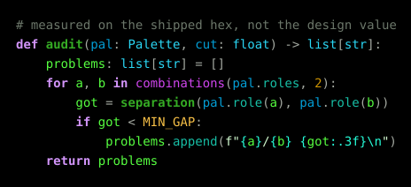
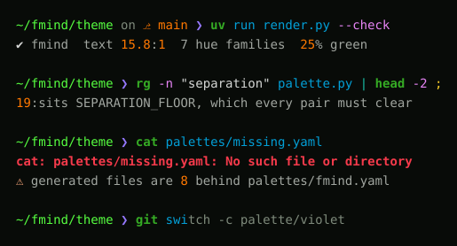
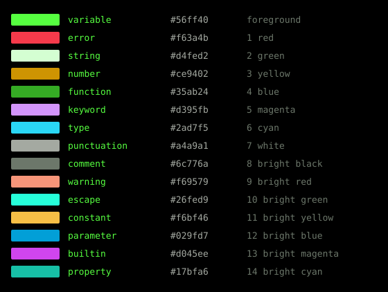

# fmind/theme

A phosphor-green terminal theme, defined once and rendered into every tool that takes a palette.

Matrix is the look; pragmatic is the rule. Every colour here is measured before it ships, and where the vibe and an eight-hour reading day disagree, the reading day wins.





## The palette

Green carries the body and the code you wrote. Three cool tiers — teal, cyan, ice — carry what the language knows. Orange holds the numbers, amber the constants, red and apricot the signals, and one violet holds the keyword. Strings are a plain white, so a docstring reads as prose rather than as more code. Comments stay grey and delimiters go quiet chalk: the two things you do not read both recede, and the body green is the brightest thing on the line.



Sixteen ANSI slots, fifteen syntax roles. The bright half is not a mechanical lightening of the normal half: each secondary is a relative of one primary — `parameter` of `variable`, `property` of `type`, `builtin` of `keyword` — placed as a role in its own right. Kinship is information; identity is a defect.

Violet is the one colour that is not part of a phosphor tube, and it earned the slot. With `keyword`, `type` and `variable` all green, the keyword sat 0.126 from the nearer of the other two and the three were routinely misread. It now sits **0.489** from the body text. No other single change measured close to that.

Where the violet sits is decided by `builtin`, not by taste. The two are the only roles in the magenta half, so moving the keyword warmer crowds the builtin and moving it cooler frees it: at hue 296 the pair measures 0.110 against a floor of 0.111 and fails, at 290 it measures 0.131 and passes with the builtin left exactly where it was. A keyword that reads pink is usually a keyword that has been pushed into its own relative's hue.

## What makes it readable

`palette.py` holds the contract and both scripts import it, so what is designed and what is shipped are measured by the same rules.

| check | rule | this palette |
| --- | --- | --- |
| contrast | body ≥ 9:1, other roles ≥ 4.5:1 | body 14.9:1, dimmest 5.3:1 |
| glare | comments capped at 6:1, `string` at 15:1, `punctuation` at 9.5:1, and the ground off zero | comments 5.5:1, string 13.8:1, punctuation 8.0:1, ground 0.0031 |
| separation | every pair ≥ 0.085 in OKLab, and up to 0.130 for pairs that sit side by side | closest pair 0.101 |
| saturation | ≥ 78% of the chroma sRGB has at that hue and lightness | lowest 88% |

Glare is the check every contrast rule gets backwards. WCAG has a floor and no ceiling, so more contrast always scores better, and a palette optimised against it walks to a maximum nobody can sit in front of all day. This one had: a pure black ground, five of fifteen roles above 13.7:1, and the loudest of them spent on the two roles that put the most glyphs on a screen — `string` at **19.7:1** on every docstring and every line of markdown prose, and `punctuation` at L 0.873 against a body at L 0.879, the same lightness as the identifiers it encloses. Legibility and fatigue are not the same measurement. Capping those two took the count over 14:1 from five to two, which is the first time the palette has a brightness hierarchy to skim by instead of leaving hue to do all of the work.

The ground is required off zero for the same reason, and for one more. A saturated body green at L 0.88 against `#000000` halates — the glyph edges bloom, worse with astigmatism, and the eye re-accommodates on every jump between the terminal and anything else on screen. Lifting it to luminance 0.0031 costs 0.9 of a contrast point and removes the hard edge. It also gives the second grounds somewhere to sit: the current line is 0.006 *above* the ground, and against a ground of exactly zero the whole ladder is squeezed into the bottom of the range.

Separation is the check a green theme needs and a normal theme gets for free, and it has to cover **every** pair, not the ones you thought to name. An earlier revision weighted 35 of the 105 pairs and left `parameter` 0.043 from `builtin` — two indistinguishable colours sitting next to each other on every call with arguments.

Saturation is measured against the gamut rather than as a flat number, because a flat floor is a green-specific value wearing a general name. sRGB gives hue 145 a chroma ceiling of 0.268 and hue 205 only 0.146, so "chroma ≥ 0.14" reads as "no hue but green" — which is how this theme came to have only one.

The same ceiling decides how loud a literal can be. `number` sat at hue 80 and was already at 99% of the chroma available there; it read dull because no setting at that hue reads otherwise. Walking it down to hue 50 buys 0.191 against 0.145 — a third more — for no change in lightness, which is why the number is orange and not amber.

## Bold yes, italic no

`FiraCode Nerd Font Mono` ships a real Bold face and **no italic face at all**, so bold carries what hue cannot. It goes on `function`, `keyword` and `error` — the roles you scan for rather than read through.

Ghostty's `bold-is-bright` must stay `false`, or bold silently swaps six semantic colours for six others. Set `font-synthetic-style = no-italic,no-bold-italic` to stop italics being faked by slanting upright glyphs.

## Use it

```bash
uv run render.py            # validate and render
uv run render.py --check    # validate only, write nothing
```

`render.py` exits non-zero rather than ship an unreadable terminal, so it is safe in a pre-commit hook or in CI.

- `palettes/fmind.yaml` — the source of truth. Edit this.
- `palette.py` — the contract and the colour maths.
- One folder per tool, generated. Never edit; re-run the renderer.

## The other grounds

A theme ships more than one background. A diff row, a completion menu, the line the cursor is on and a selection are each the ground with a little of one slot pulled into it — and each has text on top, so each is audited like the ground.

They are named by how far they sit above the ground, not by blend weight, because the blend happens in linear light and the slots do not start from the same place. Pulling 18% toward this palette's white `green` lands at luminance 0.167 — an added line brighter than most themes' body text, with body text on it at **3.6:1**. The same 18% toward `red` lands at 0.041, four times darker. One lift per surface means an added row and a removed row sit the same distance off the ground and only the hue tells them apart, which is the entire job of a diff.

A lift, not an absolute luminance. The two are the same number while the ground is `#000000`, and the difference never shows — until the ground lifts off zero, at which point a `line` stored as an absolute 0.006 sits 0.003 above the ground instead of 0.006 and the current line quietly halves. What a surface means is *this far off whatever the ground is*, so that is what `SURFACE_LIFT` stores.

The added row is pulled from `bright_green` rather than from `green`, which is the one place this palette's white string reaches past itself. Slot 2 is `string`, and spending it on a white is legitimate — but an added row mixed from a white lands neutral, and a diff whose plus row has no hue has lost the only thing it has to get right. `bright_green` carries `escape`, which is green in any palette the contract admits.

| surface | lift above the ground | body text on it |
| --- | --- | --- |
| current line | 0.006 | 13.3:1 |
| panel, menu, toolbar | 0.010 | 12.5:1 |
| heading 2 bar | 0.013 | 11.9:1 |
| added, removed, changed row | 0.014 | 11.7:1 |
| selection, emphasised run, heading 1 bar | 0.022 | 10.5:1 |

Body text holds the same 9:1 it holds against the ground; the other roles drop to 3:1, because a surface is where you read one line rather than a whole file.

## Wiring each tool

| tool | file | how |
| --- | --- | --- |
| Ghostty | `ghostty/fmind` | Copy into `~/.config/ghostty/themes/`, then `theme = fmind` |
| Zellij | `zellij/fmind.kdl` | Copy into `~/.config/zellij/themes/`, then `theme "fmind"`. Needs **0.41+** for named styles |
| fish | `fish/fmind.fish` | Source it from `~/.config/fish/conf.d/` |
| fzf | `fzf/fmind.conf` | Point `FZF_DEFAULT_OPTS_FILE` at it |
| Starship | `starship/fmind.toml` | Merge the `[palettes.*]` block into `~/.config/starship.toml` |
| delta | `delta/fmind.gitconfig` | `[include] path = …`, or paste into the `[delta]` section |
| k9s | `k9s/fmind.yaml` | Copy into `~/.config/k9s/skins/`, then set `skin:` |
| gh-dash | `gh-dash/fmind.yml` | Merge the `theme:` block into `~/.config/gh-dash/config.yml` |
| opencode | `opencode/fmind.json` | Copy into `~/.config/opencode/themes/`, then `"theme": "fmind"` |
| ptpython | `ptpython/fmind.py` | Drop next to `config.py`, then install `CODE` and `UI` |
| Neovim | `nvim/colors/fmind.lua` | Copy into `~/.config/nvim/colors/`, then `colorscheme fmind` |

Everything else reads the terminal's own colours and is themed for free: `bat --theme=ansi`, lsd, lazygit, lazydocker, bottom, atuin, yazi, fastfetch, gh, ripgrep, jq. Keeping them on ANSI is deliberate — one Ghostty line reskins the lot. What that costs is the bright half: a tool reading slot 12 gets `parameter` whatever it meant by "bright blue". It also costs slot 2, which is `string` and therefore a white: a tool that asks for "green" gets white, and the ones that mean *added* or *ok* by it get white too. Inside the theme those cases are re-pointed at `bright_green` or at `function` — k9s buttons and breadcrumbs, gh-dash's `success`. Outside it the fix belongs in the consumer, and it is one line: point whatever the tool calls *ok*, *added* or *small* at slot 4 rather than slot 2. An `ls` listing whose new files are white is a config bug, not a palette one.

For that to be true the Ghostty file also reissues the **greyscale ramp**, slots 232-255. A theme that stops at slot 15 leaves every tool that reaches into the 256-colour cube looking untouched — lsd asks for `243`, and it is not a colour the palette sets. The ramp is re-emitted at xterm's own luminance (drift under 0.005) with the theme's green cast, so those greys join in. The 6×6×6 colour cube is left alone, because tools compute gradients from its structure.

fzf is the one file here that carries slot numbers rather than colours. It draws over whatever is already on the screen, so hex would pin the finder to one palette while the terminal behind it followed Ghostty; `-1` leaves the ground and the body text exactly as they are.

Zellij gets the **named styling block** rather than its ten-colour palette form, and this is the one place where handing a tool the palette makes things worse. Given ten colours, Zellij derives its whole UI from them — and the two slots it derives *backgrounds* from are `fg` and `green`. Here that fills every unselected tab with body green and the selected tab and mode chip with the near-white `string`: the two brightest colours in the palette, painted as fills, top and bottom, for the entire session. No palette edit can reach it. The named form puts ribbons, lists and table cells on the same second grounds every other tool uses, spends the body green on the one ribbon that says where you are, and gives `frame_unselected` its own entry so an unfocused pane stops being framed exactly like the focused one.

Neovim gets a real colorscheme rather than a sixteen-colour fallback, because treesitter distinguishes captures a terminal never can: a call from its arguments, a builtin from a user function, an attribute from the object it hangs off. It drops into `colors/` on the runtimepath, so no plugin is needed.

Two tools cannot take a palette from anywhere and are left alone: **Grok** ships five built-in themes with no custom slot (`dark` is the one that survives quantization to sixteen colours), and **Claude Code** has `dark-ansi`, which is the terminal's own palette by another name.

## Markdown

Markdown is the one filetype where the palette *is* the interface, and it was the worst thing in the theme, for a reason worth writing down: the colorscheme set no `@markup.*` groups at all, so [render-markdown.nvim](https://github.com/MeanderingProgrammer/render-markdown.nvim) fell back to its own defaults — and those defaults link heading backgrounds at diff groups.

| group | its default link | what that rendered as |
| --- | --- | --- |
| `RenderMarkdownH1Bg` | `DiffText` | an amber bar |
| `RenderMarkdownH2Bg` | `DiffAdd` | a green bar |
| `RenderMarkdownH3Bg` | `DiffChange` | a brown bar |
| `RenderMarkdownH4Bg` | `DiffDelete` | **a red bar** |
| `RenderMarkdownCode` | `ColorColumn` | Neovim's default grey, untouched by the theme |

All six heading levels then resolved through `@markup.heading` to `Title`, so they shared one green as well. A document opened as a diff of itself.

Six levels now get six colours, descending in prominence — body green, cyan, violet, amber, teal, chalk — and only the top two get a bar, at the neutral `heading1` and `heading2` luminances above. Below that the ladder carries the level on its own; a bar on every heading is noise. Inline code is `escape` on the panel ground, links are `parameter` and underlined, bullets, quotes and table rules are chalk, and a checked box is `function`.

Both `@markup.heading.N` and `@markup.heading.N.markdown` are set. render-markdown links its `H1` straight at the `.markdown` variant, and a plain highlight link does not walk treesitter's fallback chain — defining only the short name leaves the group resolving to nothing.

## Adding a tool

Write a function in `render.py` that takes a `Palette` and returns `(path, contents)`, then add it to `TOOLS`. `Palette` exposes `ground`, `text`, `cursor`, `slot(0..15)`, `role(name)` and `surface(name)`; reach for `surface()` rather than mixing your own background, so the new one is audited with the rest.
